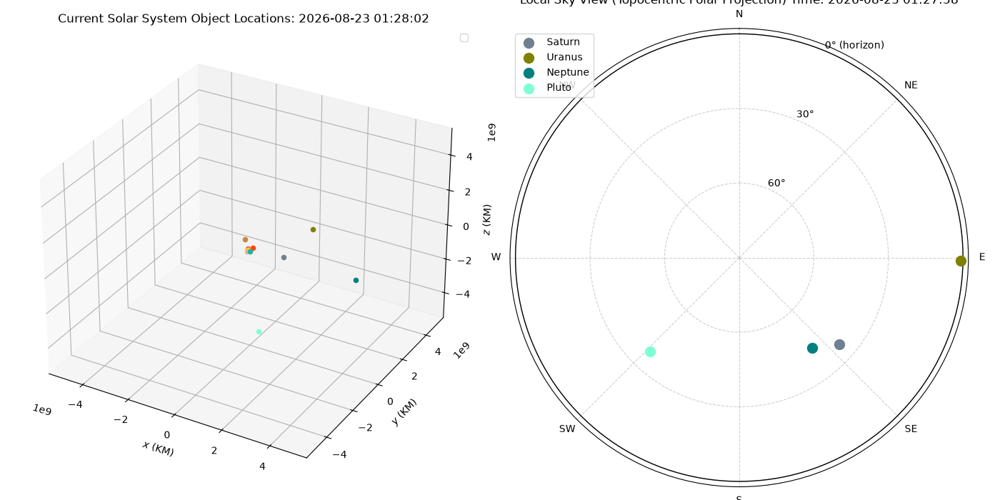

# Planet Spotter

[Link to Github Repository](https://github.com/TowakoW/Planet-Spotter)

*Work in progress* 

Planet Spotter is a simple program that pulls from NASA JPL's Horizons API and creates a short term simulation based on initial values. The goal is to create a program that allows users to see current planet locations relative to their current location on earth, as well as one of my first endeavors to become more familar with Python programming!

## Method
### Step 1: Horizons API
Real-time information is fetched from NASA JPL Horizons API for all planets in the solar system as well as the Sun and Pluto.
* Hopefully moons will be added in the future.

The received output is parsed to take only each object's GM (km^3/s^2) and ephemeris data (x, y, z, vx, vy, vz).

### Step 2: Initial Plotting

The parsed data is plotted on a 3d graph with matplotlib.pyplot.

### Step 3: Physics Simulation
Using the Semi-Implicit Euler method, the locations of the planets are calculated and updated on the graph.

#### Acceleration Calculation:

*Parameters:*
  
system: System
  
   > System object ("solar_system")
  
a: np.ndarray
  
   > Gravitational acceleration array to be modified, shape (N, 3), (km/s^2)
  
**a = sum(GM/r_norm^3 * r_ij)**

#### Semi-Implicit Euler Calculation:

*Parameters:*

system: System

  > system object ("solar_system"), system.v = system velocity
  
dt: float

  > time step.
  
a: np.ndarray

  > Gravitational accelerations array with shape (N, 3), (km/s^2).

  **system.v += a * dt**
  
  **system.x += system.v * dt**

### Step 4: Live-Updating Graph, Initial Plotting

Uses matplotlib.pyplot.ion() to create an interactive, live-updating graph for a specified period of time. Start time is taken using datetime library, and starts at the time of calling main(). The program then switches to the physics simulation to continue updating based on positional and directional values from the Horizons API.

#### See below for demo interactive 3D graph:

(Not live-updating due to Github website limitations)

**Initial plot taken from Horizons API:**

<iframe src="/TowakoW/interactive_orbit.html" width="100%" height="600px" style="border:none;"></iframe>

*Shot taken on Aug 17, 2026 at 10:35 PM*

 **8-Month Physics simulation demo:**

<iframe src="/TowakoW/interactive_track.html" width="100%" height="600px" style="border:none;"></iframe>
 
*Shot taken starting on Aug 17, 2026 at 11:25 PM*

### Step 5: Translating to Local Perspectives
Fetching location information from APIs:

Fetch IP-address: (ipify)[https://www.ipify.org/]

Fetch rough geographical location: (ip-api.com)[https://ip-api.com/]

Convert to topocentric view with the earth in the middle, then convert to spherical coordinates. Use hour angle, local sidereal time, ra, and declination (radians) to find altitude and azimuth.

**Equations:**

r = sqrt(x**2 + y**2 + z**2)
  - distance

dec = arcsin(z/r)
  - declination

asc = atan2(y, x)
  - right ascension

LST = 100.46 + 0.985547 * d + longitude + 15 * UT
  - local sidereal time

H = LST - asc
  - hour angle

altitude (a) = arcsin(sin(dec)sin(lat) + cos(dec)cos(lat)cos(H))
  - altitude

azimuth (A) = arccos((sin(dec)-sin(a)sin(lat))/cos(a)cos(lat))
  - azimuth

### Step 6: Final Plotting
Using matplotlib.pyplot, plot two sub-plots: cartesian interactable graph (live updating) and polar local sky projection. 

Shot taken on Aug 23, 2026 at 1:15 AM

### Next Steps: 
- Add moons
- Visual representation on cartesian graph showing visible part of night sky?

#### Reference:
  
["5 Steps to N-body Simulation" by alvinng4:](https://alvinng4.github.io/grav_sim/5_steps_to_n_body_simulation/step2/#implementation-3-advanced)

### Step 5: Translating to Local Perspectives
work in progress...

Converting Sun-centric cartesian coordinates (x, y, z) to a topocentric spherical coordinate graph (r, RA, DEC). Looking for a way to efficiently take location data with a python library...

## Resources
[NASA JPL Horizons API](https://ssd.jpl.nasa.gov/horizons/)

["5 steps to N-body simulation" by alvinng4](https://alvinng4.github.io/grav_sim/5_steps_to_n_body_simulation/)

### Next Steps...
* Convert cartesian coordinates to RA/DEC from the perspective of a specific point on Earth to show relative planet locations for viewers of the night sky
* Add moons and satellites

<a href="/TowakoW/" class="btn btn-sm z-depth-0" role="button">Back to Home</a>
